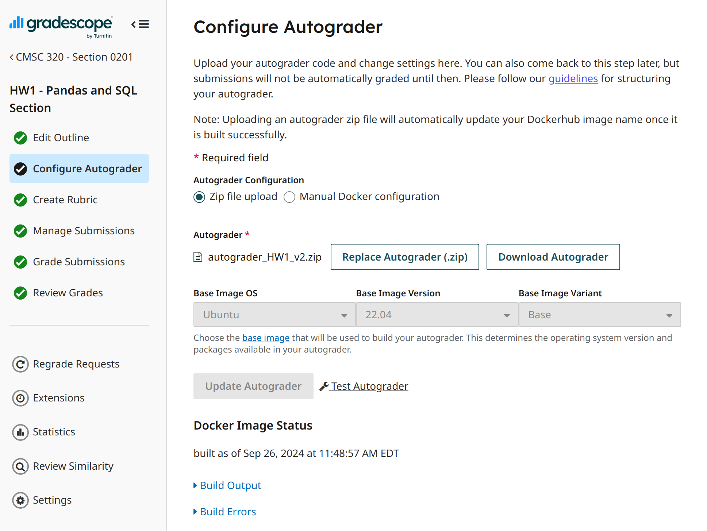

### Overview
This autograde


### Installation
```
pip install -r requirements.txt
```
```
pip install (ADDITIONAL LABRARIES FOR THE HOMWEORK)
```

### Testing in your local environments
```
python run_tests.py --notebook_path AngelaZhang_CMSC320_HW1_Fall2024.ipynb --result_path result.json --debug
```

### Uploading in the Gradescope
- You can refer to the offical Gradescope documents for the detailed explanation about how to upload the Autograder.



